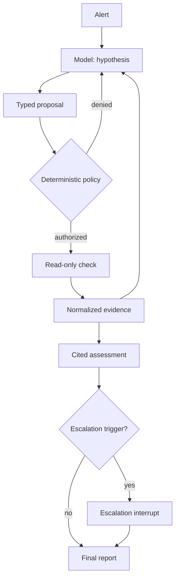

# CausalOps

## Executive summary

> CausalOps is a policy-governed agentic incident investigator that improved
> diagnosis correctness from 3/12 without tools to 8-9/12 with three bounded
> diagnostic checks, holding grounded-citation correctness at 5/12 across
> repeated real runs.

That result is measured against a fixed, evaluator-hidden 12-incident
synthetic corpus — a small sample from a local synthetic lab, not a
production benchmark, and it's the current, real number under the
currently-shipped prompt, not a historical best. See
[`docs/RESULTS.md`](docs/RESULTS.md) for the full scorecard, every real
live-model run this project has made — including where a later fix traded
some diagnosis reliability for something else, honestly reported — and
what each number does and doesn't establish.



An evidence-grounded incident investigator for a local, synthetic
microservice lab. CausalOps forms competing hypotheses about the cause of a
synthetic incident, runs a small number of safe read-only diagnostic checks
against a local Docker Compose lab, and is designed to return a cited
diagnosis or an explicit abstention.

"Causal" describes the loop CausalOps runs — hypothesis, diagnostic check,
evidence update — not formal causal inference. CausalOps is decision support
for an on-call engineer, not an autonomous operator: it never executes
remediation, mutates the lab, or acts on production-like systems. Every
system and every incident it investigates is synthetic.

The central trust boundary, unchanged everywhere in this project:

> The model proposes and interprets. Deterministic code validates,
> authorizes, executes read-only checks, stops, scores, and records.

## Tech stack

| Layer | Technology |
|---|---|
| Orchestration | [LangGraph](https://github.com/langchain-ai/langgraph) `StateGraph`, `langchain-core` |
| Model | Claude (Anthropic API — Sonnet 5 in production; Haiku 4.5 available for experiments), via `langchain-anthropic` |
| Retrieval | SQLite FTS5 (production) or [Pinecone](https://www.pinecone.io/) serverless with hosted embeddings (evaluated, not selected — see results) |
| Validation | [Pydantic v2](https://docs.pydantic.dev/) — every tool argument, policy decision, and evaluation record is a typed, schema-validated model |
| Hosted API | [FastAPI](https://fastapi.tiangolo.com/) + Uvicorn, Google OAuth (`google-auth`) with a server-verified per-owner allowlist |
| Durable state | SQLite (local checkpoints/cost ledger) or GCP Firestore (hosted, shared between the Cloud Run API and the worker) |
| Storage | GCP Cloud Storage (finalized-artifact upload, hosted deployment only) |
| Synthetic lab | Docker Compose — three project-authored Python services + Prometheus |
| Infra as code | Terraform (GCP: Firestore, Cloud Storage, Artifact Registry, Cloud Run, IAM) |
| CI | GitHub Actions — `ruff format`/`ruff check`/`mypy`/`pytest` on Linux, macOS, and Windows |
| Language/tooling | Python 3.12, [`uv`](https://docs.astral.sh/uv/), `ruff`, `mypy --strict` |

## How it works

CausalOps runs an incident investigation as a LangGraph `StateGraph`:

```text
CREATED
  -> investigate            (the model proposes a hypothesis and, optionally, one tool call)
  -> dispatch_tool           (a policy-wrapped read-only check runs, or the proposal is denied)
  -> normalize_evidence      (the result becomes a typed, bounded Evidence record)
  -> investigate | final_assessment   (looped, budget-gated)
  -> final_assessment        (DIAGNOSED or INSUFFICIENT_EVIDENCE, cited)
  -> escalation_interrupt     (only when a defined trigger fires)
  -> final_report
```

The model never talks to a tool backend directly. Every read-only tool call
goes through a policy wrapper that validates the incident scope, the
registered template, and the remaining budget *before* anything runs, and a
denied proposal never reaches a backend at all.

The model can never submit raw PromQL, shell, SQL, a URL, a filesystem path,
or code — only a registered template ID and strictly typed arguments.
Application code turns a template selection into the real query.

### The synthetic lab

Docker Compose runs three project-authored Python services plus Prometheus:

```text
gateway -> orders -> inventory
              |
       bounded resource pool
```

`orders` holds a bounded, saturable resource pool implemented in plain
Python. A scenario controller — a separate trust domain from the
investigator, never callable through model output — starts an incident,
injects one of four fault families, verifies the fault signal, and hands
the investigator only an opaque incident ID and an answer-neutral alert.
Every evaluator-only fact (the scenario family, the expected root cause, the
evidence predicates that will be used to score the run) is held out of the
model's context entirely and enforced by import-graph and content tests, not
just convention.

### Incident families

1. **Configuration change** — an orders configuration change causes
   failures.
2. **Downstream timeout with retry amplification** — inventory latency
   causes retries and elevated gateway latency.
3. **Resource-pool saturation** — the bounded orders resource pool is
   exhausted and degrades requests.
4. **Ambiguous telemetry** — differentiating evidence is absent or
   contradictory; the correct answer is abstention (`UNDETERMINED` /
   `INSUFFICIENT_EVIDENCE`), not a guess.

Every family requires at least one follow-up tool call — the initial alert
alone is never enough to diagnose correctly.

### Tools available to the model

| Tool | Typed input | Backend |
|---|---|---|
| `query_metric` | Registered PromQL template, service, bounded window | Prometheus |
| `query_logs` | Registered filter, service, bounded window, row limit | Active-run JSONL logs |
| `list_recent_changes` | Service, bounded window | Change manifest |
| `get_topology` | Active incident ID | Topology manifest |
| `search_runbooks` | Registered topic, passage limit | SQLite FTS5 (production) or Pinecone semantic (evaluated) |

Every report and evaluation record labels the retrieval mode it actually
used (`disabled`, `fts5_lexical`, or `pinecone_semantic`) rather than
leaving it implicit. Retrieved runbook text is untrusted data — it is
quoted and delimited in the model's context and cannot alter policy,
extend scope, or authorize a tool call on its own.

### A real defect this project found and fixed

Paired evaluation runs are how this project catches problems code review
alone misses. One showed up in the tool arguments themselves, not in the
policy or the graph: `QueryMetricArguments.service` and
`QueryLogsArguments.service` started as bare, undescribed `str` fields —
nothing told the model which service actually emits which metric or log
category. Across two real paid evaluation batches, the model guessed the
wrong service in 3 of 8 runs, each wrong guess burning half that run's
evidence budget on a query that could never return anything.

The fix was a `Field(description=...)` on both arguments, naming the exact
per-service restrictions in prose (`src/causalops/tools.py`) — no policy or
graph code changed, only what the model was told about a tool it already
had. This is this project's clearest example of a defect invisible to code
review — visible only by running real evaluations and reading what the
model actually did. A related, larger bug this same class of defect caused
later (a schema/budget mismatch behind 21 policy denials, fixed) is in
[`docs/RESULTS.md`](docs/RESULTS.md).

### Budgets

| Limit | Default |
|---|---:|
| Diagnostic checks executed | 2 |
| Runbook searches, a separate pool from diagnostic checks | 1 |
| Model calls, including one structured-output repair | 4 |
| Structured-output repairs | 1 |
| Live-model spend, application-wide, all runs combined | USD 5.00 |

A denied or invalid proposal still consumes a model-call slot but is never
counted as an executed check. If budget runs out before a valid diagnosis or
abstention is reached, the investigation ends `FAILED_SAFE` — a disposition
only application code can produce, never something the model selects.

A configured ceiling too small to cover even the cheapest possible request
is refused outright at startup, rather than silently accepted and then
refusing every real request one at a time — see `.env.example` for the
exact refusal conditions.

### Safety and threat model, briefly

CausalOps is reviewed against a fixed set of threats, each backed by a real,
currently-passing test rather than a design intention:

- **Tool-policy bypass** — proven unreachable by three independent tests
  (`tests/security/test_tool_boundary.py`): an import scan proving the
  dispatch boundary imports no backend, a wrapper-identity check proving a
  registry entry was actually built by the real factory (a hand-built
  wrapper fails construction outright), and a five-spy-backend test proving
  a denial actually stops execution, not just gets labeled `DENIED`.
- **Ground-truth leakage** — the model and the retrieval corpus never see
  the evaluator's scenario key, expected root cause, or evidence predicates;
  enforced by import-graph and content assertions, not just file placement.
- **Prompt injection** — telemetry and retrieved runbook text are wrapped as
  untrusted, delimited evidence; adversarial fixtures prove an injected
  instruction cannot expand scope, register a tool, or authorize an action
  policy would otherwise deny.
- **Scope escape and forged citations** — every tool call is checked against
  the active incident's own scope before it runs, and every cited evidence
  ID is re-resolved from the active incident's own store before it can reach
  a report; a forged or cross-incident ID never survives to output.
- **Resource exhaustion** — call, time, row, sample, and byte caps are
  enforced at multiple layers, independent of what the model asks for.
- **Provider and secret leakage** — the live model adapter reads its API key
  only from the process environment and never names or logs it.
- **Unbounded provider spend** — every live request is reserved against the
  application-wide ceiling *before* it is sent, using a durably persisted,
  conservative estimate; the reservation is exactly-once settled from the
  provider's real reported usage, and a request that would exceed the
  remaining ceiling is refused before it is sent, never after.

These boundaries have been tested by real defects during development, and
they held — most caught by review, two only by running real paid
evaluations and reading what the model actually did (see
[`docs/RESULTS.md`](docs/RESULTS.md)). One was boundary-adjacent and more
serious: an early cost-ledger implementation settled a request's real cost
without checking it against the reservation that authorized it, so an
overrun on one request could become permanently invisible to the spend
ceiling — reproduced concretely and fixed before merge. None of them ever
crossed a boundary above, whether review or live evaluation is what caught
it.

## Setup

Requirements: Python 3.12, [`uv`](https://docs.astral.sh/uv/), and Docker
Compose. CausalOps runs on any machine `causalops doctor` can read a
platform, RAM, and disk reading from.

```bash
uv sync --locked
uv run causalops doctor
```

`doctor` checks the operating system reading, total and available RAM, free
disk, required writable directories, the checkpoint database, Docker, and
whether `ANTHROPIC_API_KEY` is set. The operating system, RAM (total),
disk, directory, database, and Docker checks are hard failures; low
available RAM and a missing API key only warn, since `--model replay` (see
below) needs neither.

A live model call needs `ANTHROPIC_API_KEY` in the process environment —
there is no `.env` loader, so export it directly:

```bash
export ANTHROPIC_API_KEY="<your key>"
```

See `.env.example` for every environment variable CausalOps reads, including
`LIVE_EVALUATION_MAX_USD` (the application-wide live-spend ceiling; defaults
to 5.00 if unset) and `CAUSALOPS_LIVE_MODEL` (`sonnet`/`haiku`/`opus`,
defaults to Sonnet 5).

Everything above is local and free. For the separate **hosted API**
deployment (a real browser-facing sign-in flow, backed by GCP Firestore,
optionally Cloud Run) on your own GCP account, see
[`infra/DEPLOYMENT.md`](infra/DEPLOYMENT.md) to deploy it and
[`docs/CLOUD_RUN_DEMO.md`](docs/CLOUD_RUN_DEMO.md) to use it once deployed.

## Command reference

| Command | What it does |
|---|---|
| `causalops doctor` | Checks this machine can run CausalOps; see Setup above. |
| `causalops lab up` | Starts the Docker Compose lab and waits for it to be healthy. |
| `causalops lab down` | Stops the lab. |
| `causalops scenario start <family> --seed <development\|evaluation\|evaluation_b\|evaluation_c>` | Starts one incident, prints its opaque incident ID. |
| `causalops scenario reset <incident-id>` | Clears one incident's active lab state. Never touches `results/`. |
| `causalops investigate <incident-id> --model <replay\|claude>` | Runs a full investigation; `replay` is free and deterministic, `claude` is a real billed request. |
| `causalops approve <thread-id>` | Accepts a paused investigation's diagnosis or abstention. |
| `causalops reject <thread-id> "<reason>"` | Rejects a paused investigation and records why. |
| `causalops-evaluate [--executed-tools <2\|3\|4>]` | Runs the fixed paired live-evaluation corpus at one evidence-budget curve point (separate binary; defaults to 2). |
| `causalops-candidate-assess` | Offline inspector for sanitized candidate-evaluation artifacts; no provider access. |
| `causalops-qwen-evaluate` | Private-VM-only runner for the fixed Qwen/Ollama candidate corpus (see "Non-goals"). |
| `causalops-pinecone-reindex` | Administrative: upserts `runbook_corpus.json` into the provisioned Pinecone index. |

## Running an investigation

Start the lab, then start one synthetic incident:

```bash
uv run causalops lab up
uv run causalops scenario start resource_pool_saturation --seed development
#   -> prints an opaque incident id, e.g. a1b2c3d4e5f6...
```

`scenario start` takes an owner-facing family name (one of the four listed
above) but only ever returns an opaque incident ID to the caller — the
semantic family name is never passed on to `investigate`, which never
learns it.

Investigate the incident. `--model` is required, with no default, so a live
run is never accidental:

```bash
# Replay mode: no network call, zero cost, deterministic fixture playback.
uv run causalops investigate <incident-id> --model replay

# Live mode: a real, billed request to Anthropic (claude-sonnet-5),
# reserved and settled against LIVE_EVALUATION_MAX_USD.
uv run causalops investigate <incident-id> --model claude
```

A completed investigation writes its cited evidence, tool receipts, run
record, and a Markdown report to
`results/investigations/<investigation-id>/`. `DIAGNOSED` and
`INSUFFICIENT_EVIDENCE` are both successful, exit-0 outcomes —
`INSUFFICIENT_EVIDENCE` means the investigation correctly recognized the
evidence couldn't distinguish a cause, not that anything went wrong.
`FAILED_SAFE` and an unavailable dependency exit nonzero with a stable
reason code.

When you're done with an incident: `uv run causalops scenario reset
<incident-id>` — removes only that incident's active lab/transient state,
never a finalized report under `results/`.

### Escalation: owner approval and rejection

Some investigations pause for owner review instead of finishing
automatically — specifically when the model's evidence conflicts, a tool
becomes unavailable mid-investigation, evidence is insufficient with a check
still available, or runbook retrieval coverage is judged insufficient.
CausalOps never uses an uncalibrated model confidence score to decide this;
only one of those four deterministic reasons triggers it. A paused
investigation exits `3` and prints a `thread_id` you resume with:

```bash
uv run causalops approve <thread-id>
uv run causalops reject <thread-id> "<reason>"
```

`approve` accepts the paused diagnosis or abstention and resumes the graph
to a finished report. `reject` records the owner's disposition and reason
without changing the underlying assessment, then also finishes the report.
Both routes are checkpointed through SQLite (`checkpoints.db`), so a resume
survives a process restart, and an identical retry returns the same
recorded decision rather than resuming twice. Verified end to end against
the real Docker lab, both the approve and reject paths, not only through
directly-constructed test fixtures.

## Demo video

**[Watch the walkthrough](https://youtu.be/iDr9oj04_Ec)**

A recorded walkthrough of the hosted (Cloud Run) deployment — sign-in,
creating an investigation across all four incident families, the
pause/approve/reject flow — following
[`docs/CLOUD_RUN_DEMO.md`](docs/CLOUD_RUN_DEMO.md). The hosted demo
infrastructure is torn down between sessions to avoid ongoing cost, so this
video is the durable record of it running.

## Results and evaluation

Every number in the Executive summary above, and every experiment this
project has run against the real live model, is documented in full —
methodology, raw run IDs, and honest negative results included — in
[`docs/RESULTS.md`](docs/RESULTS.md). Highlights:

- **8-9/12 correct diagnoses, 5/12 fully grounded**, at the recommended
  `executed_tools=3` operating point, across two repeated real batches —
  the current headline result.
- **A real mechanical bug found and fixed via live evaluation**: 21 policy
  denials across 36 tool-enabled runs, traced to a schema/budget mismatch,
  eliminated to 0/36 after the fix.
- **A preregistered Pinecone-vs-FTS5 RAG comparison**, run for real at two
  evidence budgets: not selected at the recommended et=3 point (a narrow
  grounding-quality gap, after root-causing why neither backend was used
  at all); mixed at et=4 (Pinecone actually ahead there, reported honestly,
  doesn't change the decision). FTS5 remains the production backend.
- **A four-way root-cause investigation into why the model never used its
  retrieval tool**: backend quality, budget pricing, and model capability
  were each tried and ruled out; a direct imperative prompt instruction
  fixed usage (0/12 → 12/12) — but not for free: `FAILED_SAFE` at et=3 rose
  from 0/12 to 2/12 alongside it, reported as measured, not smoothed over.
- **Usage isn't the same as impact**: with the tool reliably used, real
  batches showed diagnostic query volume essentially unchanged whether the
  mandatory runbook call happened or not (2.92 vs 2.79 mean) — guidance was
  being cited, not acted on. Letting the model pick the search topic
  *after* gathering evidence instead of blind from the alert was tried and
  reverted: it cost usage reliability (12/12 → 7/12) for an unconfirmed
  relevance benefit.

## Development

```bash
uv run ruff format --check .
uv run ruff check .
uv run mypy src lab
uv run pytest -q -m "not docker"
```

Docker-marked tests (`-m docker`) run against the real lab and are excluded
from the default run above; bring the lab up first with `causalops lab up`
before running them.

Repository shape:

```text
src/causalops/     application code (graph, tools, policy, CLI, telemetry adapters)
lab/                the synthetic Docker Compose services and their fixtures
tests/unit/         unit tests
tests/integration/  tests against the real Docker lab
tests/security/     trust-boundary and isolation tests
results/            gitignored investigation and evaluation artifacts
docs/               results, and the hosted-deployment walkthrough
infra/              Terraform, Docker, and deployment docs for the hosted API
```

## Non-goals

CausalOps does not build causal graphs, estimate counterfactual outcomes, or
run more than one investigator. It has no remediation executor: it may
record an owner-approved suggested next step, but it never executes,
verifies, or claims to fix anything. Beyond the small owner-only dashboard
the hosted API serves (sign-in and investigation status, no model controls),
it does not add a general-purpose web UI, Kubernetes, or cloud hosting
beyond the optional Cloud Run split described above. It has no
default-path second model provider — the Qwen/Ollama candidate is a
private-VM-only, gated experiment (`causalops-qwen-evaluate`), not
something a normal install ever reaches — and no database beyond SQLite
(local) and Firestore (the hosted deployment's own durable state, not a
separate addition). All data — services, telemetry, incidents — is
synthetic; nothing here touches a real production system.

## License

MIT — see [`LICENSE`](LICENSE).
